🔐 Login credentials
===
All the logins use the same credentials.

>**Username**:
> ```yaml
>student
>```
>**Password**:
>```yaml
>learn_ansible
>```

👋 Introduction
===

#### ⏰ Estimated time to complete: 10 minutes

ACME Corp is experiencing a network outage between the Raleigh data center and Johannesburg remote office. A backup link exists between Raleigh and Johannesburg via Dublin.

<a href="#disconnected">
  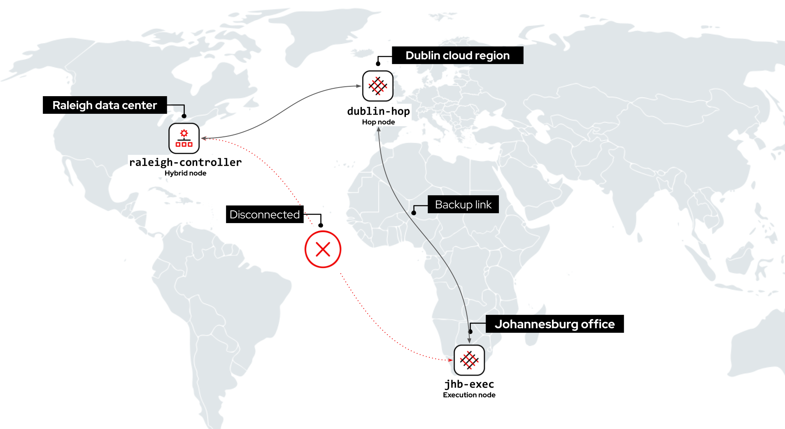
</a>

<a href="#" class="lightbox" id="disconnected">
  
</a>

In this challenge, we’ll use the Dublin Hop node to connect the Raleigh automation controller to the Johannesburg remote office.

>**❗️ Note**
>
>* Perform all tasks in the _Controller_ tab located at the top-left of your browser.
>* If required, log into the automation controller using the provided credentials.
>* You can expand the images by clicking on them for a closer look.
>* Task checks might take a few seconds longer in this challenge.

☑️ Task - Perform an instance health check
===

Automation mesh performs periodic health checks on worker nodes. These health checks can be triggered via the controller WebUI or API.

>**❗️ Note**
>
>* Depending on the controller view, you might encounter the same mesh worker nodes showing different health *Status* information in this demo environment.
>* In supported installation designs, this will not occur.
>* For more information on supported patterns, please read the [official documentation](https://access.redhat.com/documentation/en-us/red_hat_ansible_automation_platform/2.0-ea/html/red_hat_ansible_automation_platform_installation_guide/index).


##### ✏️ Let’s perform a health check on the Johannesburg execution node.

* On the side navigation under the **Administration** section, click on **Topology view**.

<a href="#jhb_exec_topology_unhealthy">
  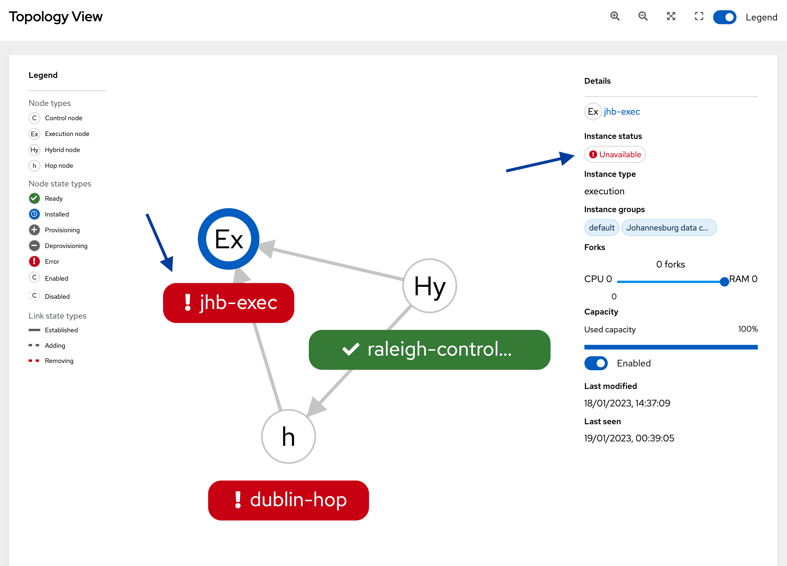
</a>

<a href="#" class="lightbox" id="jhb_exec_topology_unhealthy">
  
</a>

Note that `jhb-exec` is showing an _Unavailable_ status.

* Click on the `jhb-exec` node in the topology.
* Under *Details*  on the top right-hand corner of the window, click on the `jhb-exec` link. This opens a new window.
* Click on the *Reload* link to update the UI.
* Click on the **Run Health Check** button to confirm the _Unavailable_ status. This takes a few seconds to complete.


<a href="#jhb_exec_unhealthy">
  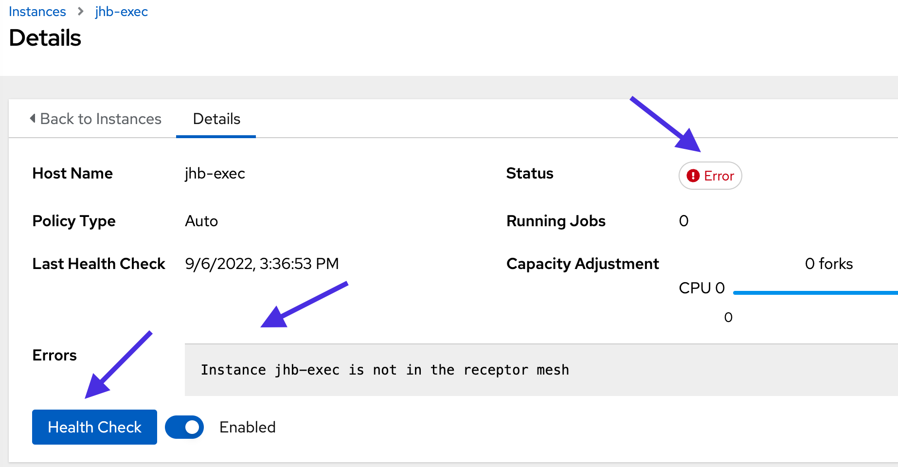
</a>

<a href="#" class="lightbox" id="jhb_exec_unhealthy">
  
</a>

Note the message in *Errors* box. The `jhb-exec` node is unreachable from automation controller.

☑️ Task - Run the Mesh route info job template
===

The `Mesh route info` job template displays the path mesh uses to run automation jobs in Johannesburg.

##### ✏️ Confirm the `jhb-exec` instance is unreachable using the `Mesh route info` job template.

* On the side navigation under the **Resources** section, click on **Templates**.
* Click on the  icon next to the `Mesh route info` job template to launch it.

<a href="#route_info_launch">
  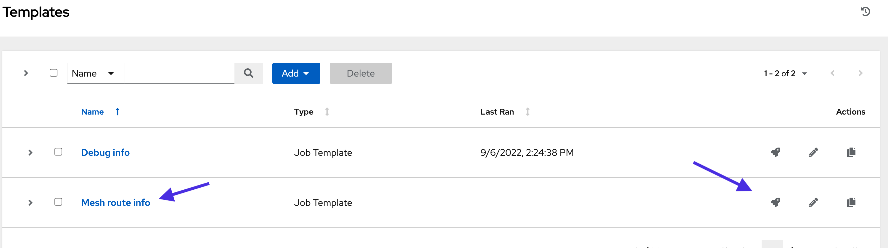
</a>

<a href="#" class="lightbox" id="route_info_launch">
  
</a>

* A new window will prompt you to choose an inventory. Keep the default selection of `Raleigh DC`.
* Click **Next** and then click **Launch**.

<a href="#route_info_raleigh_fail">
  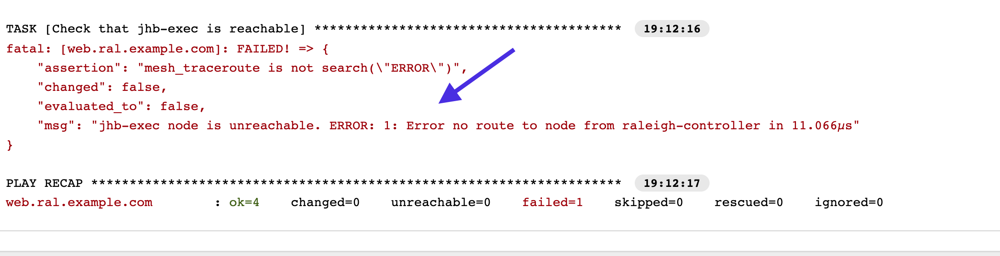
</a>

<a href="#" class="lightbox" id="route_info_raleigh_fail">
  
</a>

Note the `Mesh route info` job template output.

```text
Error no route to node from raleigh-controller
```

☑️ Task - Configure the dublin-hop node
===

ACME Corp must enable the `dublin-hop` hop node to route automation traffic between Raleigh and Johannesburg. They’ve created the `Setup Dublin hop node` job template and a new `Dublin DC` inventory in automation controller to perform the configuration.

>**❗️ Note**
>
>The `Setup Dublin hop node` job template is a simple example to demonstrate automation mesh resiliency. Please visit the [official documentation](https://access.redhat.com/documentation/en-us/red_hat_ansible_automation_platform/2.2) for supported architectures and best practices.

##### ✏️ Let’s run the `Setup Dublin hop node` job template to enable the `dublin-hop` node.

* On the side navigation under the **Resources** section, click on **Templates**.
* Click on the  icon next to the `Setup Dublin hop node` job template to launch it.

The job template displays the current status of `dublin-hop`. Note that automation mesh dynamically added `dublin-hop` to the mesh routing table.

<a href="#setup_dublin_output">
  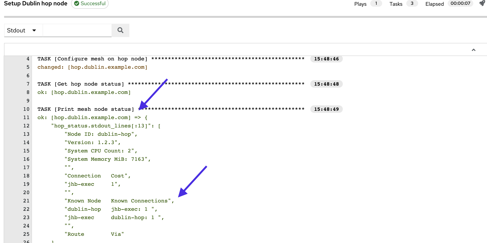
</a>

<a href="#" class="lightbox" id="setup_dublin_output">
  
</a>

>ℹ️ Automation mesh dynamically peered the Dublin hop, Johannesburg execution and the Raleigh hybrid nodes and updated the mesh routing table.

☑️ Task - Confirm Johannesburg is reachable
===

##### ✏️ Let's confirm the new route to the Johannesburg data center.

* On the side navigation under the **Resources** section, click on **Templates**.
* Click on the  icon next to the `Mesh route info` job template to launch it.
* A new window will prompt you to choose an inventory. Keep the default selection of `Raleigh DC`.
* Click **Next** and then click **Launch**.

<a href="#route_info_raleigh_hop">
  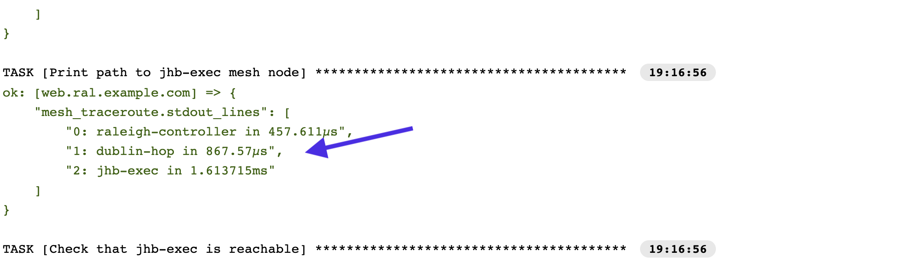
</a>

<a href="#" class="lightbox" id="route_info_raleigh_hop">
  
</a>

Note that `dublin-hop` is used to reach `jhb-exec`.

☑️ Task - Check jhb-exec health status
===

>**❗️ Note**
>
>* Depending on the controller view, you might encounter the same mesh worker nodes showing different health *Status* information in this demo environment.
>* In supported installation designs, this will not occur.
>* For more information on supported patterns, please read the [official documentation](https://access.redhat.com/documentation/en-us/red_hat_ansible_automation_platform/2.0-ea/html/red_hat_ansible_automation_platform_installation_guide/index).

**Let’s confirm `jhb-exec` is in a healthy state.**

* On the side navigation under the **Administration** section, click on **Topology View**.
* Click on the `jhb-exec` node in the topology.
* Under the *Details* section at the top right-hand corner, click on the `jhb-exec` link.
* Click on the **Run health check** button.
* Click on the *Reload* link to update the UI. This takes a few seconds to complete.

<a href="#jhb_exec_healthy_check">
  
</a>

<a href="#" class="lightbox" id="jhb_exec_healthy_check">
  
</a>

Note that `jhb-exec` is now showing a healthy status.

☑️ Task - Run automation in the Johannesburg remote office
===

##### ✏️ Confirm we can run automation in Johannesburg using the `Debug info` job template.

* On the side navigation under the **Resources** section, click on **Templates**.
* Click on the  icon under the Actions column to launch the job template.
* Select the `Johannesburg DC` inventory.
* Click **Next** and then click on **Launch**.

<a href="#debug_info_jhb_output">
  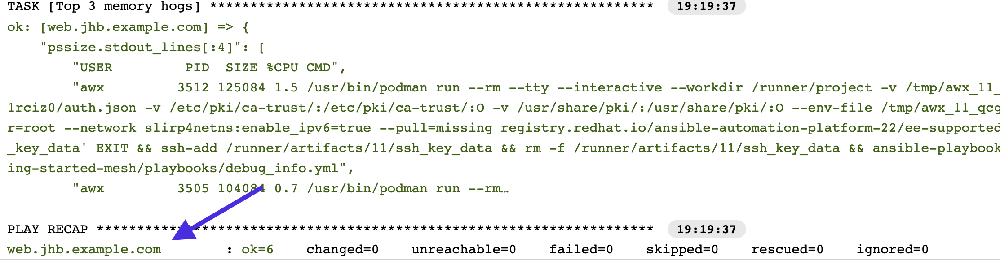
</a>

<a href="#" class="lightbox" id="debug_info_jhb_output">
  
</a>

The `Debug info` job template was executed successfully!

🎉 Congratulations!
===

**Well done on completing the lab!**

We covered a few features of [automation mesh](https://www.ansible.com/products/automation-mesh) in this lab. However, it offers so much more.

**Simplified operations -** Removes the dependency on ancillary tools such as jump hosts and SSH proxies.

**Flexible design options -** From single-site deployments to platform installations spanning the globe.

**Scale reliably -** Native fault tolerance and redundancy and new features, such as hop nodes with resiliency to connection disruptions and network latency.

**Scale securely** Transport Layer Security (TLS) encryption and centrally managed via controller to leverage features, such as [RBAC (Role-Based Access Control)](https://docs.ansible.com/automation-controller/latest/html/userguide/security.html#role-based-access-controls).

✅ Where to go next
===
Whether you are beginning your automation journey or a seasoned veteran, there are a variety of resources to enhance your automation knowledge:

* [Self-paced exercises](https://www.redhat.com/en/engage/redhat-ansible-automation-202108061218) - Explore all our self-paced labs
* [Trial subscription](http://red.ht/try_ansible) - Are you ready to install in your environment? Get your trial subscription for unlimited access to all the components of Ansible Automation Platform.
* [Subscribe to the Red Hat Ansible Automation Platform YouTube channel. ](https://www.youtube.com/ansibleautomation)

✅ Next Challenge - Playground
===

The next challenge is a place for you to explore and play with the remaining time. Feel free to try it out!\
Press the `Check` button below to go to the next challenge once you’ve completed the tasks.

🐛 Encountered an issue?
====

If you have encountered an issue or have noticed something not quite right, please [open an issue](https://github.com/ansible/instruqt/issues/new?labels=getting-started-mesh&title=Getting+started+with+automation+mesh+issue&assignees=craig-br).

---
slug: multi-site
id: enp79ggq2g3m
type: challenge
title: Multi-site automation using mesh
teaser: Run automation jobs across multiple sites using automation mesh
notes:
- type: text
  contents: "# \U0001F44B Assigning instance groups to ACME Corp inventories\n\n\n\nIn
    this challenge, we'll assign the mesh execution nodes to different regions by
    associating instance groups to ACME Corp controller inventories.\n\n<style type=\"text/css\"
    rel=\"stylesheet\">\nh1,h2{\n  text-align: center;\n}\np {\n  text-align: center;\n}\nimg
    {\n  display: block;\n  margin-left: auto;\n  margin-right: auto;\n  height: 60%;\n\n}\n</style>"
tabs:
- title: Controller
  type: service
  hostname: raleigh-controller
  port: 443
- title: editor
  type: service
  hostname: raleigh-controller
  path: /editor/
  port: 443
  new_window: true
- title: api
  type: service
  hostname: raleigh-controller
  path: /api/v2
  port: 443
difficulty: basic
timelimit: 600
---
🔐 Login credentials
===
All the logins use the same credentials.

>**Username**:
> ```yaml
>student
>```
>**Password**:
>```yaml
>learn_ansible
>```

👋 Introduction
===

#### ⏰ Estimated time to complete: 10 minutes

Now that we’ve created instance groups for the Raleigh and Johannesburg regions and associated the corresponding instances, we can assign these instance groups to the appropriate ACME Corp controller [inventories](https://docs.ansible.com/automation-controller/latest/html/userguide/inventories.html).

>**❗️ Note**
>* Perform all tasks in the _Controller_ tab located at the top-left of your browser.
>* If required, log into the automation controller using the provided credentials.
>* You can expand the images by clicking on them for a closer look.

☑️ Task - Assign instance groups to inventories
===

>ℹ️ Instance groups and the associated mesh worker nodes are assigned to automation controller objects, such as _organizations_, _inventories_, and _job templates_.

ACME Corp must assign the correct instance groups to the Johannesburg and Raleigh locations to ensure the closest mesh worker node executes the automation in the respective environments.

##### ✏️ Let’s associate the `Raleigh data center` instance group with the `Raleigh DC` inventory.

* On the side navigation under the **Resources** section, click on **Inventories**.
* Click on the `Raleigh DC inventory`.
* Click on **Edit**.
* Click on the magnifying glass button under **Instance Groups**.
* Check the box next to **Raleigh data center**.
* Click on **Select**.
* Click on **Save** in the **Edit Details** window.

<a href="#raleigh_inv_ig">
  
</a>

<a href="#" class="lightbox" id="raleigh_inv_ig">
  
</a>

##### ✏️ Let’s do the same for the `Johannesburg data center` instance group and `Johannesburg DC inventory`.

* On the side navigation under the **Resources** section, click on **Inventories**.
* Click on the `Johannesburg DC` inventory.
* Click on **Edit**.
* Click on the _magnifying glass button_ under **Instance Groups**.
* Check the box next to **Johannesburg data center**.
* Click on **Select**.
* Click on **Save** in the **Edit Details** window.

<a href="#jhb_inv_ig">
  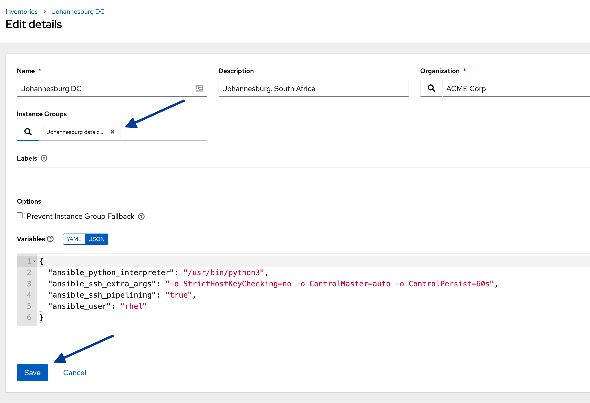
</a>

<a href="#" class="lightbox" id="jhb_inv_ig">
  
</a>

☑️ Task - Selecting where to run your automation
===

ACME Corp IT received reports of slow website response times. They must gather system information from Red Hat Enterprise Linux (RHEL) instances in the Johannesburg remote office and Raleigh data center.

They’ll use the pre-created `Debug info` [job template](https://docs.ansible.com/automation-controller/latest/html/userguide/job_templates.html) to gather information and fault find.

##### ✏️ Let’s execute the `Debug info` job template in the Raleigh data center.

* On the side navigation under the **Resources** section, click on **Templates**.
* Click on the  icon under the **Actions** column on the `Debug info` job template row. This will open a new window.

<a href="#debug_info_raleigh">
  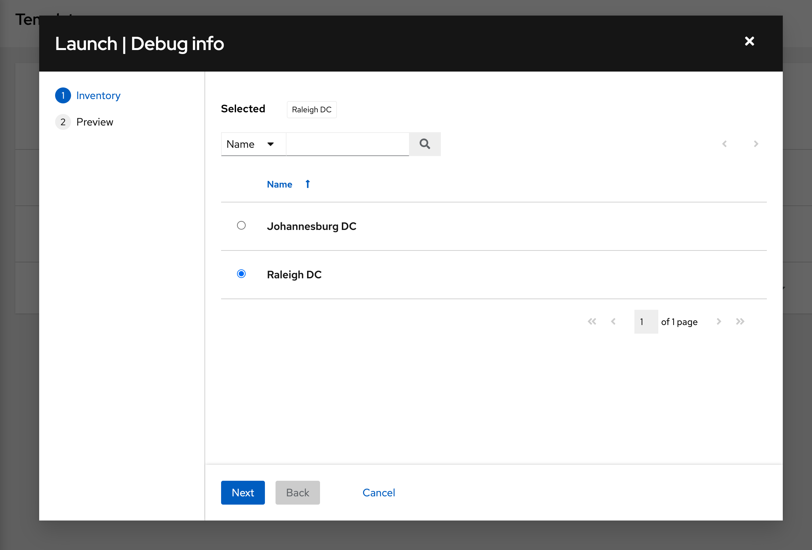
</a>

<a href="#" class="lightbox" id="debug_info_raleigh">
  
</a>

>**❗️ Note**
>
>The `Debug info` job template is configured to ask which inventory to use before launching. Job templates provide the ability to prompt user input for specific parameters before execution. This is useful as we need to run the automation on multiple ACME Corp inventories.

* Keep the `Raleigh DC` inventory as the selection.
* Click on **Next** and then click on **Launch**. This opens the *Job Output* window.

<a href="#debug_info_raleigh_details">
  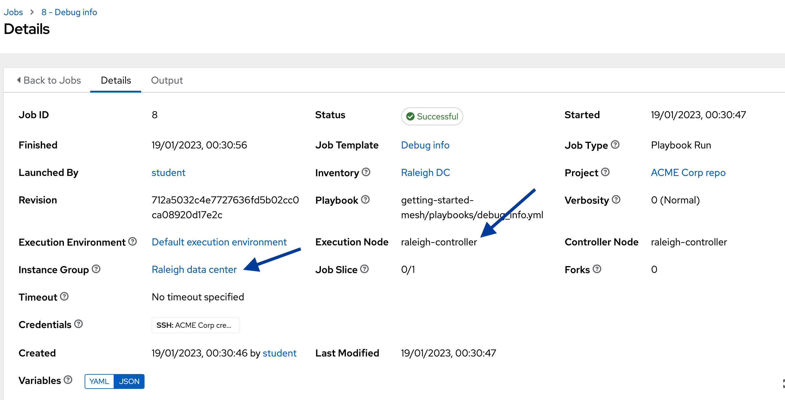
</a>

<a href="#" class="lightbox" id="debug_info_raleigh_details">
  
</a>

* Click on the **Details** tab on the top of the window

Note that it used the `Raleigh data center` instance group and `raleigh-controller` instance to run the job.

##### ✏️ Next, we’ll run the `Debug info` job template in the Johannesburg region.

* On the side navigation under the **Resources** section, click on **Templates**.
* Click on the  icon under the _Actions_ column on the `Debug info` job template row. This will open a new window.

<a href="#debug_info_jhb_inv">
  
</a>

<a href="#" class="lightbox" id="debug_info_jhb_inv">
  
</a>

* Select the `Johannesburg DC` inventory.
* Click on **Next** and then click on **Launch**. This will open the *Job Output* window.
* As we did in the previous steps, click on the **Details** tab at the top of the window.

<a href="#debug_info_jhb_details">
  
</a>

<a href="#" class="lightbox" id="debug_info_jhb_details">
  
</a>

Note that it used the `Johannesburg data center` instance group and the `jhb-exec` instance to run the job.

☑️ Task - Looking under the covers - mesh overlay network
===

Let's look at the route automation mesh used to reach the remote worker nodes and run the `Debug info` job template.

The `Mesh route info` job template uses the automation mesh `receptorctl` command line tool to return the status of the `jhb-exec` worker node in the Johannesburg remote office. The job template also displays the path the automation job took to gather the information.

##### ✏️ Let’s look at the route from the Raleigh data center to `jhb-exec` using the `Mesh route info` job template.

* On the side navigation under the **Resources section**, click on **Templates**.
* Click on the  icon under the _Actions_ column in the `Mesh route info` job template row.

<a href="#route_info_launch">
  
</a>

<a href="#" class="lightbox" id="route_info_launch">
  
</a>

* This will open a new window. Keep the `Raleigh DC` inventory as the selection.
* Click on **Next** and then click on **Launch**.

Verify in the `Output` window that all the tasks succeeded.

<a href="#mesh_route_raleigh_path">
  
</a>

<a href="#" class="lightbox" id="mesh_route_raleigh_path">
  
</a>

Under the _Print_ path to mesh node task, note that the first hop in the path is `raleigh-controller` before reaching `jhb-exec`. This indicates that the job was initiated in Raleigh and used the `raleigh-controller` hybrid node to contact the `jhb-exec` execution node.

##### ✏️ Next, run the `Mesh route info` job template using the `Johannesburg DC` inventory.

* Follow the above steps to run the `Mesh route info` job template.
* This time, select the `Johannesburg DC` inventory.
* Click on **Next** and then click on **Launch**.

<a href="#mesh_route_jhb_path">
  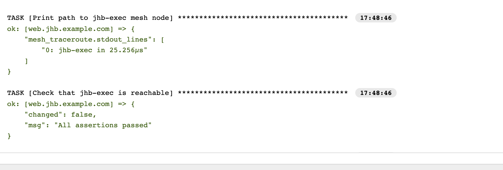
</a>

<a href="#" class="lightbox" id="mesh_route_jhb_path">
  
</a>

Under the _Print_ path to mesh node task, note that no extra hops were required to reach `jhb-exec` as we initiated the automation in the Johannesburg remote office.

✅ Next Challenge
===
Press the `Check` button below to go to the next challenge once you’ve completed the tasks.

🐛 Encountered an issue?
====
If you have encountered an issue or have noticed something not quite right, please [open an issue](https://github.com/ansible/instruqt/issues/new?labels=getting-started-mesh&title=Getting+started+with+automation+mesh+issue&assignees=craig-br).

<style type="text/css" rel="stylesheet">
  .lightbox {
    display: none;
    position: fixed;
    justify-content: center;
    align-items: center;
    z-index: 999;
    top: 0;
    left: 0;
    right: 0;
    bottom: 0;
    padding: 1rem;
    background: rgba(0, 0, 0, 0.8);
    margin-left: auto;
    margin-right: auto;
    margin-top: auto;
    margin-bottom: auto;
  }
  .lightbox:target {
    display: flex;
  }
  .lightbox img {
    max-width: 60%;
    max-height: 60%;
  }
  html {
    font-size: 14px;
  }
  img {
    display: block;
    margin-left: auto;
    margin-right: auto;
    width: 100%;
  }
  h1 {
    font-size: 18px;
  }
  h2 {
    font-size: 16px;
    font-weight: 600
  }
  h3 {
    font-size: 14px;
    font-weight: 600
  }
  p {
    font-size: 14px;
  }
  p span {
    font-size: 14px;
  }
  ul li span {
    font-size: 14px
  }
</style>
